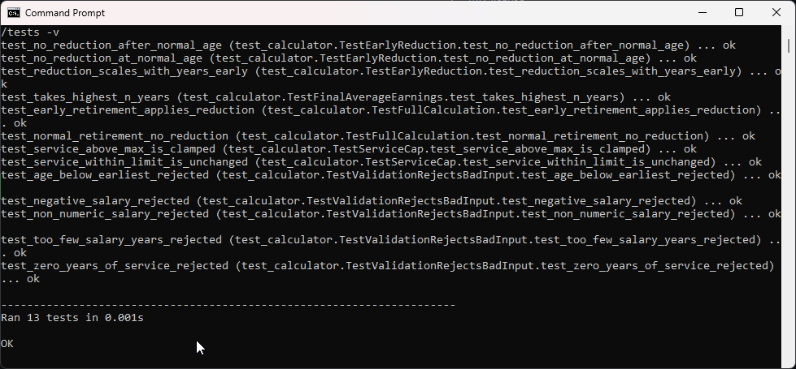
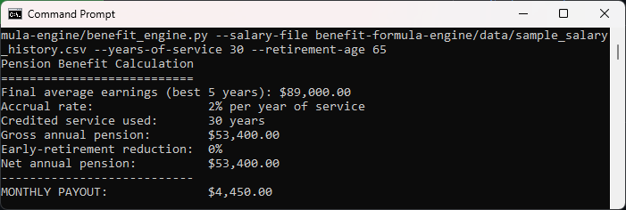
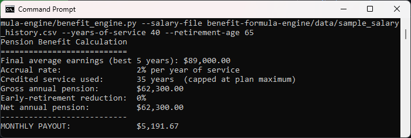
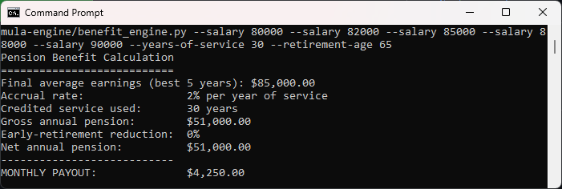
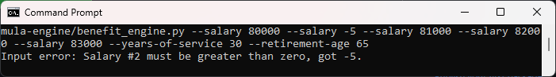
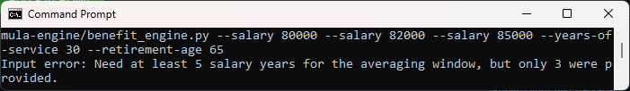
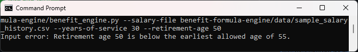

# Benefit Formula Engine

Calculates a monthly defined-benefit pension payout from a member's salary history, credited
service, and retirement age. The plan rules (accrual rate, averaging window, early-retirement
penalty, service cap) are all configurable in `plan_rules.py`.

See [spec.md](spec.md) for the full design blueprint.

## How to run

From the repository root, using the sample salary file:

```
python benefit-formula-engine/benefit_engine.py --salary-file benefit-formula-engine/data/sample_salary_history.csv --years-of-service 30 --retirement-age 60
```

Or pass salaries directly:

```
python benefit-formula-engine/benefit_engine.py --salary 80000 --salary 82000 --salary 85000 --salary 88000 --salary 90000 --years-of-service 30 --retirement-age 65
```

## In action

The test suite passing:



Retiring at the normal age of 65, with no reduction:



The same member retiring five years early at 60, with a 30 percent reduction applied:


Service of 40 years clamped to the plan maximum of 35:



Salaries passed directly on the command line instead of from a file:



The validation guards rejecting bad input instead of returning a wrong number:







## Running the tests

```
python -m unittest discover -s benefit-formula-engine/tests -v
```

## Files

- `benefit_engine.py` command-line entry point (reads input, prints the breakdown)
- `calculator.py` pure calculation functions
- `validators.py` input validation, all in one place
- `plan_rules.py` the configurable plan rules
- `data/sample_salary_history.csv` synthetic sample data
- `tests/test_calculator.py` unittest suite
