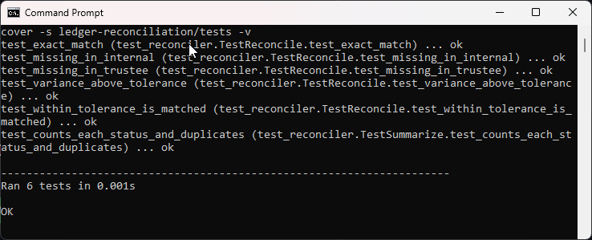
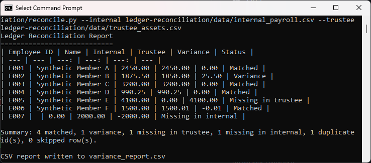
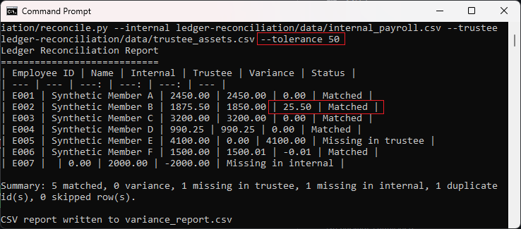
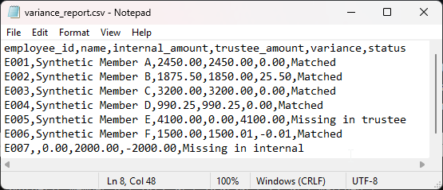

# Ledger Reconciliation Tool

Compares an internal payroll ledger against a third-party trustee ledger by Employee ID and
reports every variance. It flags amount mismatches, IDs missing from either side, duplicate
IDs, and rows with unreadable amounts.

See [spec.md](spec.md) for the full design blueprint.

## How to run

From the repository root:

```
python ledger-reconciliation/reconcile.py --internal ledger-reconciliation/data/internal_payroll.csv --trustee ledger-reconciliation/data/trustee_assets.csv
```

## In action

The test suite passing:



The full reconciliation report. Each row shows a different rule at work: a clean match, a real
money variance on E002, an ID missing from each side, a penny difference on E006 that falls
inside tolerance, and a duplicate ID caught in the summary:



The same data judged against a wider tolerance of 50, so the $25.50 difference on E002 is now
treated as a match:



The run also writes a CSV report you could hand to someone, shown here opened in a text editor:



The CSV report is written to `variance_report.csv` by default.

## Running the tests

```
python -m unittest discover -s ledger-reconciliation/tests -v
```

## Files

- `reconcile.py` command-line entry point (reads files, prints the table, writes the CSV report)
- `reconciler.py` pure comparison logic
- `loader.py` CSV loading and column validation
- `data/internal_payroll.csv`, `data/trustee_assets.csv` synthetic sample data
- `tests/test_reconciler.py` unittest suite
