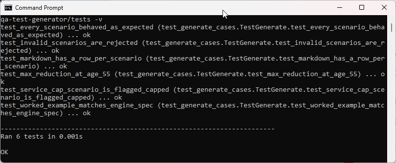
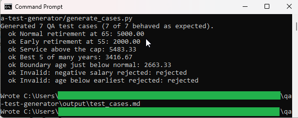
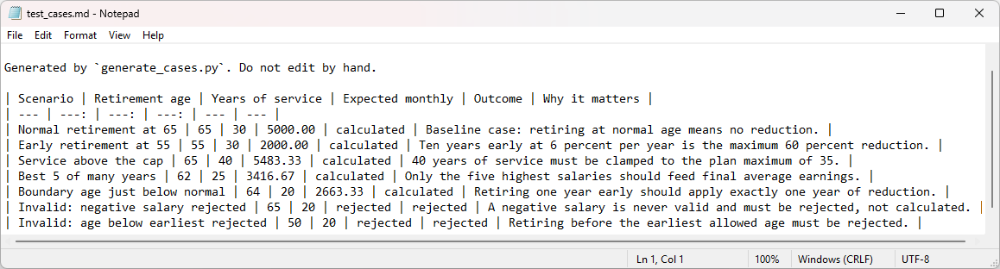
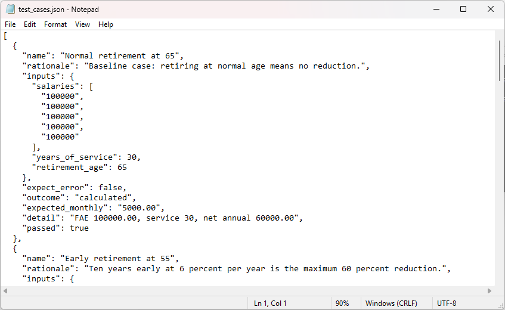

# QA Test-Case Generator

Builds a set of edge-case scenarios for the Benefit Engine, runs each one through the actual
engine, and writes a test-case table plus a JSON file. This is how engine output gets validated
after a change: regenerate the cases and confirm the expected values still hold.

See [spec.md](spec.md) for the full design blueprint.

## How it links to the Benefit Engine

This tool imports the Benefit Engine from the sibling `benefit-formula-engine` folder, so the
QA cases are produced by the same code they verify. The "Normal retirement at 65" scenario is a
deliberate cross-check: it must produce $5,000.00 per month, the worked example in the engine's
own spec.

## How to run

From the repository root:

```
python qa-test-generator/generate_cases.py
```

## In action

The test suite passing:



Running the generator. Every scenario behaves as expected, and "Normal retirement at 65" returns
5000.00, the exact value from the Benefit Engine spec, which confirms the two tools agree:



The generated markdown table that a reviewer would read:



The same cases as structured JSON, ready to drive an automated suite:



The generator writes two artifacts into `output/`:

- `test_cases.md` a markdown table for review
- `test_cases.json` the same data as structured JSON

## Running the tests

```
python -m unittest discover -s qa-test-generator/tests -v
```

## Files

- `generate_cases.py` command-line entry point (runs scenarios, writes artifacts)
- `scenarios.py` the edge-case definitions (data, not logic)
- `output/` where the generated artifacts land
- `tests/test_generate_cases.py` unittest suite
